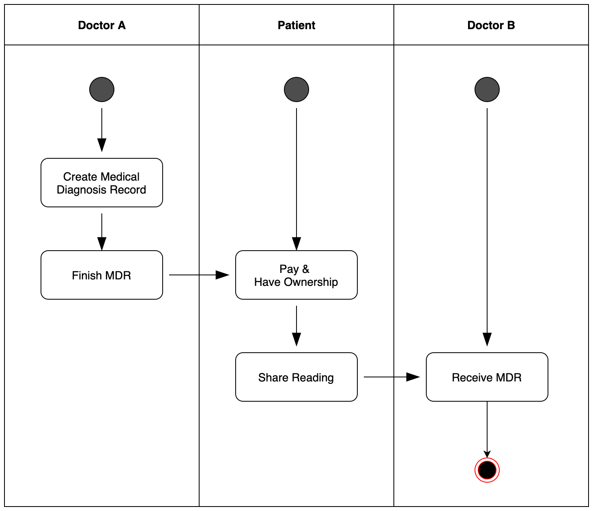
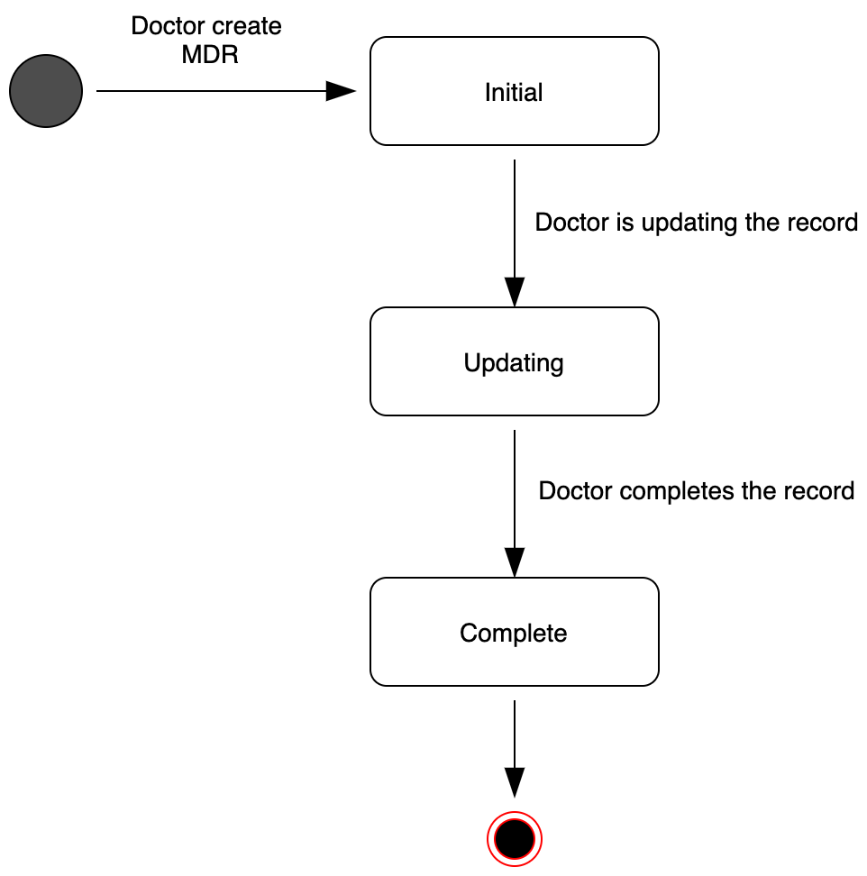
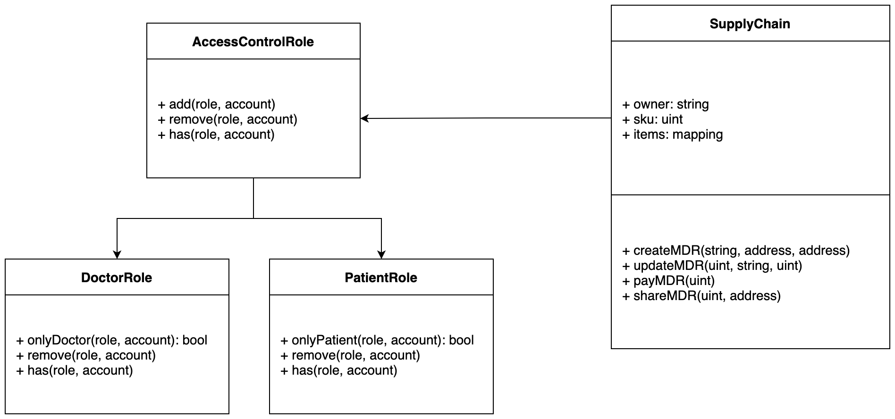

# Supply chain & data auditing

This repository shows a supply chain DAPP. 

## Contract address and transaction hash

This project was deployed on the rinkeby testnet.

```
 transaction hash:  0x06bd75d30a16f142b9f6efdb0d9f5ac5f4aa663af94f4528464914d5718b6d9e

 contract address:  0x5e51e9d49eff1f5b7ce5667db8a60242f50e5b14

```

## UML Diagrams
Activity Diagram


Sequence Diagram


State Diagram


Class Diagram



###  Runing the project

Truffle is used in this project because it makes development easier
and also it is an asset pipeline for ethereum

Web3.js is a collection of libraries for interacting with an ethereum node


versions used:

node v14.17.5,

truffle v4.1.17,

web3 v0.20.7

Install packages

```
npm install

npm install -g truffle@4.1.17

```


Connect to the ganache-cli

```
ganache-cli -m "spirit supply whale amount human item harsh scare congress discover talent hamster"

```

Delete the build folder and compile again

```
truffle compile

```
Test smart contract

```
truffle test
```
All 10 tests should pass (but it depends on the solidity version)


To Migrate smart contracts to the rinkeby:

```
truffle migrate --network rinkeby

```

## Running the frontend


```
npm run dev

```


Available Accounts obtained from ganache phrase above

    ```
Contract Owner -   (0) 0x27d8d15cbc94527cadf5ec14b69519ae23288b95

Farmer         -   (1) 0x018c2dabef4904ecbd7118350a0c54dbeae3549a

Distributor    -   (2) 0xce5144391b4ab80668965f2cc4f2cc102380ef0a

Retailer       -   (3) 0x460c31107dd048e34971e57da2f99f659add4f02

Consumer       -   (4) 0xd37b7b8c62be2fdde8daa9816483aebdbd356088
    
    ```

Hosted using fleek

[ipfs link](https://ipfs.io/ipfs/QmdRQp4asGSYzDXW76vq5H7isR6mB8wK9vH8x1pQ81C4Ym/)


