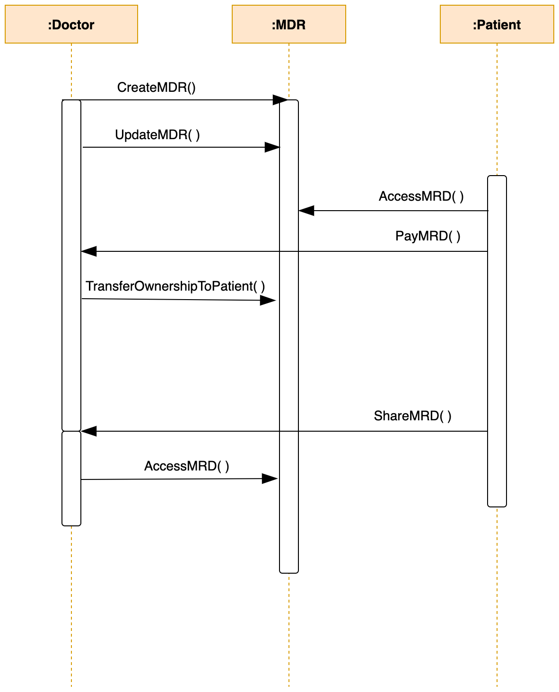

# Supply chain & data auditing

This repository shows a supply chain DAPP. 

## Contract address and transaction hash

This project was deployed on the rinkeby testnet.

```
 transaction hash:  0x0323dead907960414f8044ebd492c740465411ae97bccedd0ab53c88d801349c

 contract address:  0xaF8266bc89b7B92D3D8771758371233E2396Beac

```

## UML Diagrams
Activity Diagram


Sequence Diagram


State Diagram


Class Diagram


###  Runing the project

Truffle is used in this project because it makes development easier
and also it is an asset pipeline for ethereum

Web3.js is a collection of libraries for interacting with an ethereum node


versions used:

node v14.17.5,

truffle v4.1.17,

web3 v0.20.7

Install packages

```
npm install

npm install -g truffle@4.1.17

```


Connect to the ganache-cli

```
ganache-cli -m "spirit supply whale amount human item harsh scare congress discover talent hamster"

```

Delete the build folder and compile again

```
truffle compile

```
Test smart contract

```
truffle test
```
All 10 tests should pass (but it depends on the solidity version)


To Migrate smart contracts to the rinkeby:

```
truffle migrate --network rinkeby

```

## Running the frontend


```
npm run dev

```


Available Accounts obtained from ganache phrase above

    ```
Contract Owner -   (0) 0x27d8d15cbc94527cadf5ec14b69519ae23288b95

Doctor         -   (1) 0x018c2dabef4904ecbd7118350a0c54dbeae3549a

Patient    -   (2) 0xce5144391b4ab80668965f2cc4f2cc102380ef0a
    
    ```


